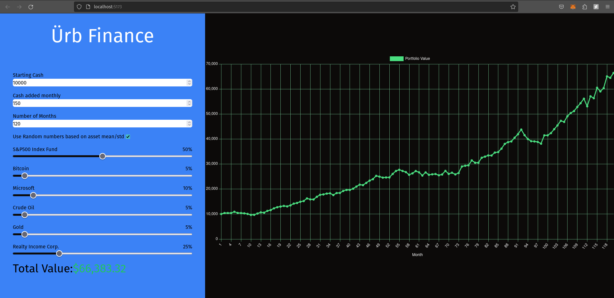

# NOW LIVE
https://urb-gold.vercel.app/
featuring the stockData service as a Google Cloud Run Function

# Ürb Finance

## Description
A fun twist on compound interest calculators like https://www.investor.gov/financial-tools-calculators/calculators/compound-interest-calculator
Instead of entering an interest rate, the mean returns of assets are used and can be weighted in your portfolio. The sd can also be used to generate random
values within a reasonable but random range for those assets to visualize a portfolio's risk and potential performance.

## Instructions
First run the main.py file with python to host a flask server to route yfinance data. This is much faster than requesting on the frontend and does not require API keys.

Next run `npm run dev` to see the svelte project!
Refer to Svelte documentation for instructions on building a production application
